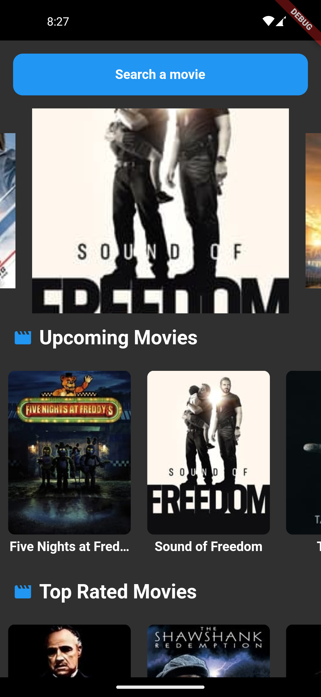
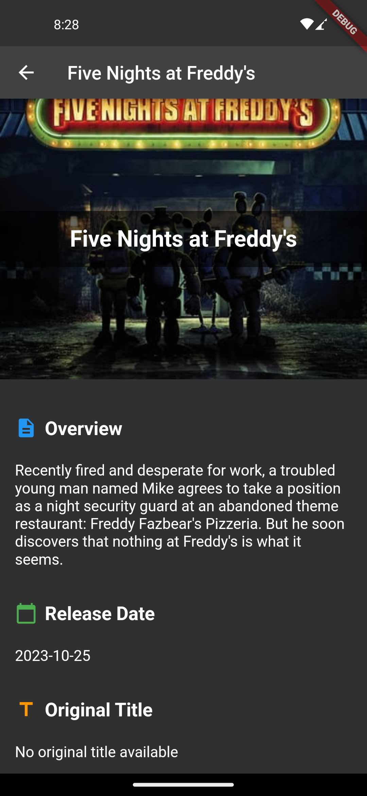
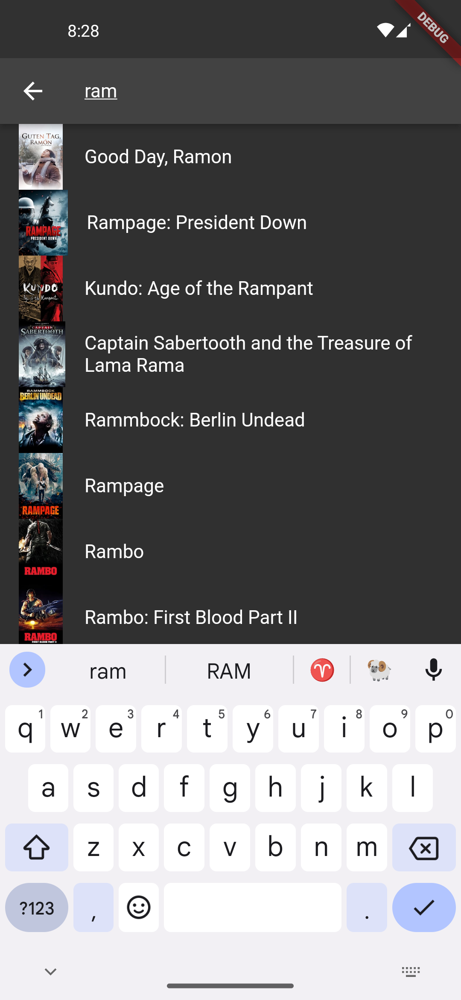
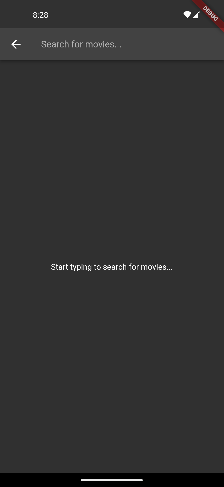

# Movie Catalog Flutter App

**Movie Catalog** is a feature-rich Flutter application for movie enthusiasts. It provides a user-friendly interface to explore, search, and delve into the world of movies. Discover your favorite films and get comprehensive details with just a few taps!



## Table of Contents

- [Features](#features)
- [Architecture Overview](#architecture-overview)
- [Screenshots](#screenshots)
- [Getting Started](#getting-started)
- [Usage](#usage)
- [Contributing](#contributing)
- [License](#license)
- [Acknowledgments](#acknowledgments)

## Features

- **Browse by Categories:** Explore movies categorized as *Upcoming*, *Top Rated*, and *Now Playing*.

- **Search Functionality:** Find movies quickly by entering keywords in the search bar.

- **Movie Details:** Dive into detailed movie information, including title, overview, release date, and an eye-catching poster.

- **Smooth Navigation:** Seamlessly switch between the homepage and movie details with an intuitive interface.

## 🏛️ Architecture Overview

The architecture of the Movie Catalog app is designed for efficiency and clarity. Here's an overview of its key components:

- **HomePage:** The app's main screen where you can access movie categories, initiate searches, and view a list of movies.

- **Networking:** Handles HTTP requests to fetch movie data from the TMDb API, ensuring smooth data retrieval.

- **FutureBuilder:** Dynamically manages UI based on the loading state, successful data retrieval, or error conditions.

- **MovieDetailsPage:** Displays in-depth movie information when you tap on a movie poster.

- **Search Functionality:** Allows users to search for movies based on keywords, filtering and displaying relevant results.

- **Error Handling:** Provides user feedback through SnackBars for scenarios like no internet connectivity or failed API requests.
## Widgets Used

The Movie Catalog app takes advantage of several Flutter widgets to craft its engaging user interface:

- **AppBar**: Positioned at the top of the screen, it holds the app title and the search input field for movie searches.

- **IconButton**: Used for the search icon in the AppBar, allowing users to initiate searches.

- **FutureBuilder**: Key in fetching and presenting movie data gracefully by managing the loading, success, and error states.

- **CarouselSlider**: Creates an engaging image carousel effect, showcasing movie posters dynamically.

- **ListView.builder**: Constructing horizontally scrollable lists of movies in various categories, enabling a seamless browsing experience.

- **ClipRRect**: For rounded corners of movie poster images, giving a polished appearance.

- **SnackBar**: Provides user feedback for errors and actions such as refreshing the data.

- **RefreshIndicator**: Implemented to enable the pull-to-refresh functionality, allowing users to manually refresh the displayed movie data.

These widgets, carefully composed, come together to offer an appealing and interactive movie browsing experience.

## Screenshots

<div align="center">
    
    
    
</div>

## Getting Started

Set up and run the Movie Catalog app on your local development environment with these steps:

### Prerequisites

Ensure you have the following software installed:

- **Flutter SDK:** Follow the [official installation guide](https://flutter.dev/docs/get-started/install) for your platform.
- **Dart SDK:** Included with Flutter.

### Installation

1. Clone this repository to your local machine:

```bash
git clone https://github.com/sandeshkhadka283/EVEGRP.git

### Running the App

Use the following command to build and run the app on an emulator or physical device:

```bash
flutter run

This will launch the app on your connected device.

## Usage

**Home Screen:**

- Upon launching the app, you will start on the homepage.
- Explore movies by selecting categories, including *Upcoming*, *Top Rated*, and *Now Playing*.
- Use the search icon to find movies based on keywords.

**Movie Details:**

- Tap on a movie poster on the Home Screen to access the Movie Details page.
- Here, you can find more information about the selected movie, including its poster, title, and description.

**Search Screen:**

- Navigate to the search page using the search icon on the Home Screen.
- Enter keywords in the search bar to find movies.
- Tapping on a searched movie will take you to its Movie Details page.

## Contributing

Want to contribute to the project? Follow these steps:

1. **Fork** this repository.

2. Create a new branch for your feature or bug fix: 

   ```bash
   git checkout -b feature/your-feature-name
